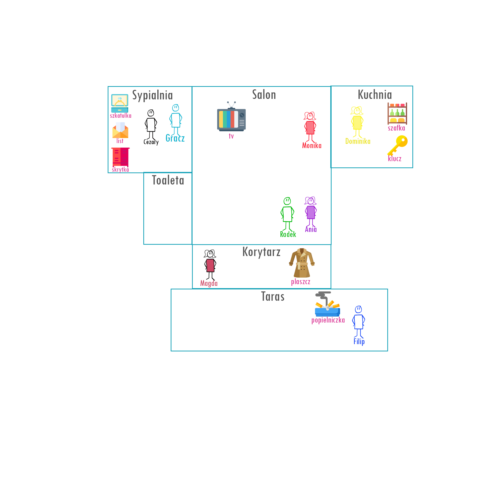

# Criminal-game-prolog
A simple criminal, fictional game written in Prolog. 

## Table of contents
* [How to play](#how-to-play)
* [Idea](#idea)
* [Map](#map)

## How to play
Need to install [SWI-Prolog](https://www.swi-prolog.org/). 

After installation compile the file Game_prolog.pl and *play* as writing the functions. 

Game is written in polish language.

## Idea
Player is at the party and got a quest to find the thief who has stolen valuable ring. 
List of actions player can do:
```
samouczek :-
				write('-----------------------------------------------'),nl,
				write('Samouczek'),nl,
				write('Gdy chcesz wiedziec gdzie sie znajdujesz --> opis.'),nl,
				write('Gdy chcesz z kims porozmawiac --> porozmawiaj(imie).'),nl,
				write('Gdy chcesz zadac komus pytanie --> zadaj_pytanie(index_pytania).'),nl,
				write('Gdy chcesz cos zbadac wpisz --> zbadaj(nazwa).'),nl,			
				write('Gdy chcesz isc w inne miejsce --> idz(miejsce).'),nl,
				write('Gdy chcesz sprawdzic droge --> droga(miejsce_od, miejsce_do).'),nl,
				write('Aby sprawdzic rzeczy w torebce --> rzeczy.'),nl,
				write('UWAGA! Podczas rozmow korzystaj z oskarzen tylko gdy jestes pewny!'),nl,
				write('-----------------------------------------------'),nl.
```

There are people you can ask questions, items to collect and places to visit 

## Map
Additionaly I created a simple map to not to get too confused :smirk:
<p align="center">

</p>
